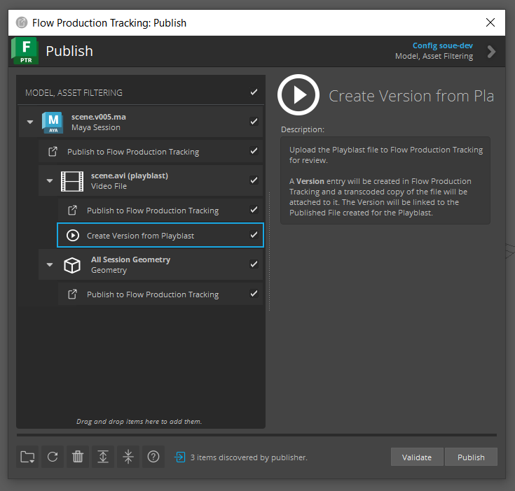

Publish Customization
=====================

The sections below identify the entry points for customizing publish workflows.
For a broad overview of how publish execution works, see the
:ref:`publish-execution` doc.

.. _publish-collector:

Collector Hook
--------------

The collector hook handles processing the current user’s session to identify
what will be published. It also handles processing any file paths that have been
dragged/dropped onto the Publisher or added manually via the
:ref:`publish-api`. Once the collector identifies what is to be published,
:ref:`Publish Item <publish-api-item>` instances are created within the tree
and presented to the user.

.. note:: For more information on how to take over, subclass, and manage hooks,
    see the :ref:`Hooks <sgtk_hook_docs>` documentation.

----

Collector Hook API
__________________

.. py:currentmodule:: tk_multi_publish2.base_hooks
.. autoclass:: CollectorPlugin
    :show-inheritance:
    :members:

.. _publish-plugin:

Publish Plugin
--------------

Publish plugins are hooks that handle processing of collected publish items.
After all items have been collected, the Publisher attempts to match the items
with the appropriate publish plugins. All matched plugins show up as child tasks
within the publish item hierarchy.

With ``v2.0.0`` of the publisher and higher, each plugin can define a custom UI
that allows users to make changes to the publish settings prior to publishing.
See the methods and properties section below for details on how to implement a
custom publish plugin UI.

.. note:: For more information on how to take over, subclass, and manage hooks,
    see the :ref:`Hooks <sgtk_hook_docs>` documentation.

----

Step-by-Step Tutorials
__________________________________

Listed below are step-by-step tutorials to help you customize your publish
workflows using publish plugins. See :ref:`publish-api` reference for more
technical details of the Publish Plugin.

Create a Publish Plugin
****************************

This tutorial will guide you through the process of creating a new publish
plugin to create a new Version in Flow Production Tracking from a Playblast file
in Maya, and customizing your Toolkit configuration to use this new plugin. This
tutorial will focus on creating and setting up a new publish plugin, and less
about the specifics of Playblasts in Maya (it does not require extensive
knowledge of Maya or Playblasts, only if you want to test out this change you
would need to know how to create a Playblast in Maya). If you are interested in
creating a new publih plugin for another DCC, you can still follow this
tutorial, but you will need to add the configuration settings under the
appropriate DCC in your Toolkit configuration.

Before you begin, you will need to have the following:

* A local copy of your Toolkit configuration
* The configuration must be based off the tk-config-default2 configuration

**1. Add a new publish plugin setting to your configuration.**

We need to add a new setting to the tk-multi-publish2 app configuration in
order to use our new publish plugin. We will modify the
``tk-config-default2/env/includes/settings/tk-multi-publish2.yml`` file to add a
new entry under the ``settings.tk-multi-publish2.maya.asset_step`` publish_plugins
list called "Create Version from Playblast":

.. code-block:: yaml

    # ---- Maya

    # asset step
    settings.tk-multi-publish2.maya.asset_step:
    collector: "{self}/collector.py:{engine}/tk-multi-publish2/basic/collector.py"
    collector_settings:
        Work Template: maya_asset_work
    publish_plugins:
    - name: Publish to Flow Production Tracking
        hook: "{self}/publish_file.py"
        settings: {}
    - name: Upload for review
        hook: "{self}/upload_version.py"
        settings: {}
    - name: Begin file versioning
        hook: "{engine}/tk-multi-publish2/basic/start_version_control.py"
        settings: {}
    - name: Publish to Flow Production Tracking
        hook: "{self}/publish_file.py:{engine}/tk-multi-publish2/basic/publish_session.py"
        settings:
            Publish Template: maya_asset_publish
    - name: Publish to Flow Production Tracking
        hook: "{self}/publish_file.py:{engine}/tk-multi-publish2/basic/publish_session_geometry.py"
        settings:
            Publish Template: asset_alembic_cache
    - name: Create Version from Playblast
        hook: "{self}/upload_version.py:{config}/tk-multi-publish2/basic/upload_version_playblast.py"
        settings: {}
    help_url: *help_url
    location: "@apps.tk-multi-publish2.location"

This is the new entry we added to the configuration:

.. code-block:: yaml

    - name: Create Version from Playblast
        hook: "{self}/upload_version.py:{config}/tk-multi-publish2/basic/upload_version_playblast.py"
        settings: {}

The publish plugin will have the name "Create Version from Playblast" and will
use the publish plugin defined by the hook
``tk-config-default2/hooks/tk-multi-publish2/upload_version_playblast.py``. The
``{config}`` token will be resolved to the path of your Toolkit configuration.

The publish plugin will have the base class of the publish plugin defined in the
tk-multi-publish2 App ``tk-multi-publish2/hooks//upload_version.py``. The
``{self}`` token will be resolved to the path of the tk-multi-publish2 App.

**2. Create the new publish plugin file.**

From Step 1, we defined a new publish plugin file in the configuration at the
location ``tk-config-default2/hooks/tk-multi-publish2`` and named
``upload_version_playblast.py``. So we will now need to create that file, below
is the implementaiton of the new publish plugin file:

.. code-block:: python

    import sgtk

    HookBaseClass = sgtk.get_hook_baseclass()

    class MayaUploadVersionPlayblastPlugin(HookBaseClass):
        """Plugin for sending Playblasts to Flow Production Tracking for review."""

        @property
        def description(self):
            """
            Verbose, multi-line description of what the plugin does. This can
            contain simple html for formatting.
            """

            return """
            Upload the Playblast file to Flow Production Tracking for review.  

            A <b>Version</b> entry will be created in Flow Production Tracking and
            a transcoded copy of the file will be attached to it. The Version will be
            linked to the Published File created for the Playblast.
            """

        @property
        def settings(self):
            """
            Dictionary defining the settings that this plugin expects to recieve
            through the settings parameter in the accept, validate, publish and
            finalize methods.

            A dictionary on the following form::

                {
                    "Settings Name": {
                        "type": "settings_type",
                        "default": "default_value",
                        "description": "One line description of the setting"
                }

            The type string should be one of the data types that toolkit accepts as
            part of its environment configuration.
            """
            return {
                "Upload": {
                    "type": "bool",
                    "default": True,
                    "description": "Upload content to Flow Production Tracking?",
                },
                "Link Local File": {
                    "type": "bool",
                    "default": True,
                    "description": "Should the local file be referenced by Flow Production Tracking",
                },
            }

        @property
        def item_filters(self):
            """
            List of item types that this plugin is interested in.

            Only items matching entries in this list will be presented to the
            accept() method. Strings can contain glob patters such as *, for example
            ["maya.*", "file.maya"]
            """

            return ["file.video"]

        def accept(self, settings, item):
            """
            Method called by the publisher to determine if an item is of any
            interest to this plugin. Only items matching the filters defined via the
            item_filters property will be presented to this method.

            A publish task will be generated for each item accepted here. Returns a
            dictionary with the following booleans:

                - accepted: Indicates if the plugin is interested in this value at
                    all. Required.
                - enabled: If True, the plugin will be enabled in the UI, otherwise
                    it will be disabled. Optional, True by default.
                - visible: If True, the plugin will be visible in the UI, otherwise
                    it will be hidden. Optional, True by default.
                - checked: If True, the plugin will be checked in the UI, otherwise
                    it will be unchecked. Optional, True by default.

            :param settings: Dictionary of Settings. The keys are strings, matching
                the keys returned in the settings property. The values are `Setting`
                instances.
            :param item: Item to process

            :returns: dictionary with boolean keys accepted, required and enabled
            """

            return {"accepted": True}

        def validate(self, settings, item):
            """
            Validates the given item to check that it is ok to publish.

            Returns a boolean to indicate validity.

            :param settings: Dictionary of Settings. The keys are strings, matching
                the keys returned in the settings property. The values are `Setting`
                instances.
            :param item: Item to process

            :returns: True if item is valid, False otherwise.
            """

            path = item.get_property("path")
            if not path:
                self.logger.error("Missing Playblast file path.")
                return False
            return True

        def publish(self, settings, item):
            """
            Executes the publish logic for the given item and settings.

            :param settings: Dictionary of Settings. The keys are strings, matching
                the keys returned in the settings property. The values are `Setting`
                instances.
            :param item: Item to process
            """

            # Set the publish name property for the UploadVersionPlugin to consume
            item.properties["publish_name"] = item.get_property("sg_publish_data", {}).get("name")

            super(MayaUploadVersionPlayblastPlugin, self).publish(settings, item)

Breaking down this publish plugin:

* The ``description`` property provides a verbose description of what the plugin
  does. This description will be displayed in the UI when the plugin is selected.

* The ``settings`` property defines the settings that the plugin expects to
  receive. The settings are used to help guide the publish plugin execution.

* The ``item_filters`` property defines the item types that the plugin is
  interested in. Only items matching the filters defined here will be presented
  to the plugin. For example, we know that Playblast files are video files, so
  we set the item filter to ``file.video``.

* The ``accept`` method is called by the publisher to determine if an item is of
  interest to the plugin. A plugin will only show up in the publisher if it is
  accepted.

* The ``validate`` method validates the item to check if it is ok to publish. A
  publish plugin will not execute its publish method if it is does not pass the
  validation.

* The ``publish`` method executes the publish logic for the given item and settings.
  In our case, the publish method will create a new Version in Flow Production
  Tracking and attach the Playblast file to it.

See the :ref:`publish-api` reference for more information on how to extend the
MayaUploadVersionPlayblastPlugin class.

**3. Run Maya with your modified configuration.**

Now that you have created the new publish plugin and added it to your
configuration, you can run Maya with your modified configuration. When you run
the Publisher, you should see the new "Create Version from Playblast" plugin:

Publish Plugin API
__________________

.. py:currentmodule:: tk_multi_publish2.base_hooks
.. autoclass:: PublishPlugin
    :show-inheritance:
    :members:

Post Phase Hook
---------------

.. py:currentmodule:: tk_multi_publish2.base_hooks
.. autoclass:: PostPhaseHook
    :show-inheritance:
    :members:
