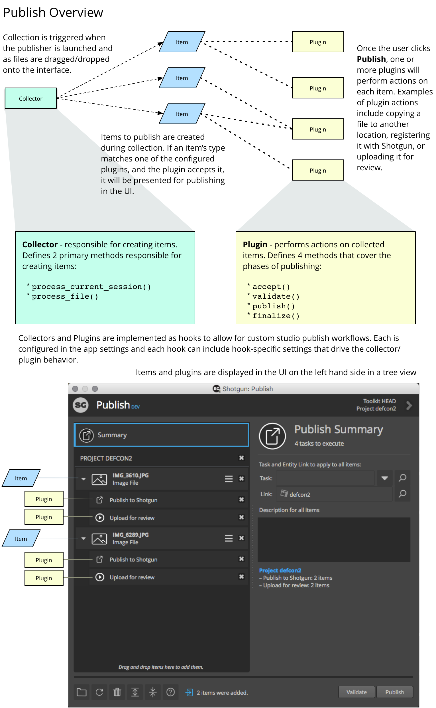

Shotgun Publisher API reference, |release|
##########################################

Overview
********

The Publish app is highly customizable by way of hooks that control how items
are presented to artists for publishing and how those items are then processed.

The graphic below outlines the major concepts of the publish2 app and API. The
links on the left can be used to examine each of these concepts in detail.

The following sections outline all of the hooks and APIs available to studios
for publish workflow customization.

.. toctree::
    :maxdepth: 2

    execution
    Collection <collector>
    Items <items>
    Publish Plugins <plugin>
    logging
    utility
    application
