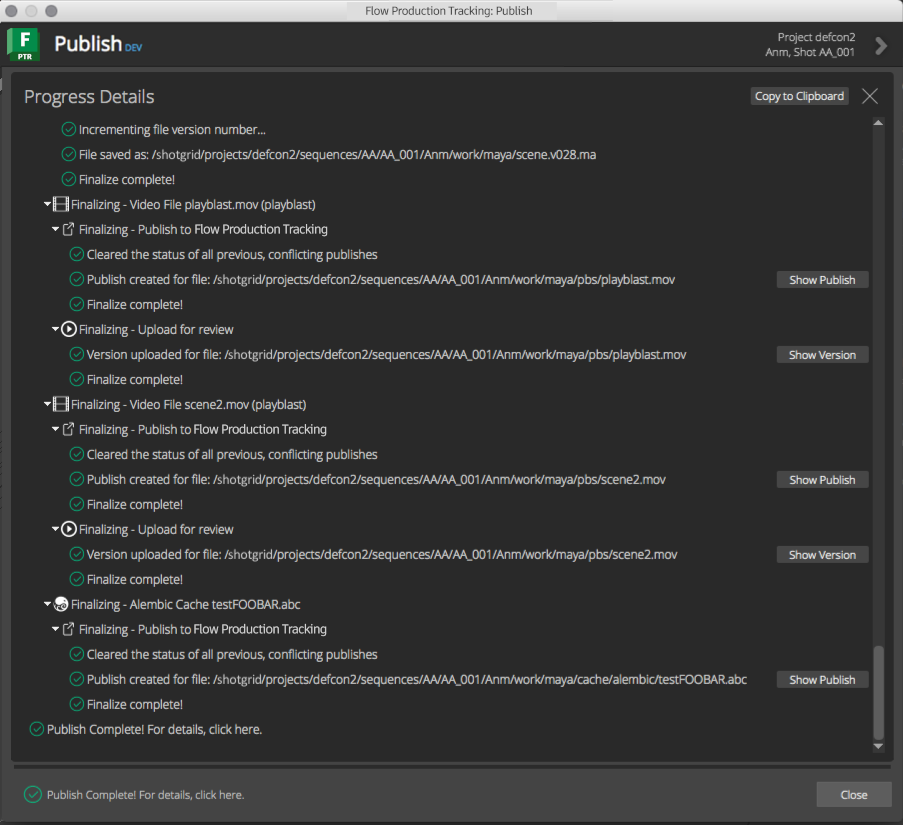
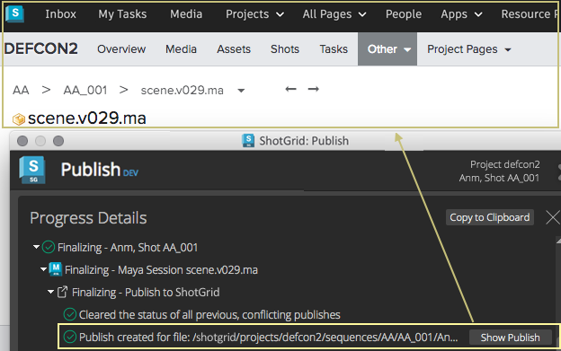
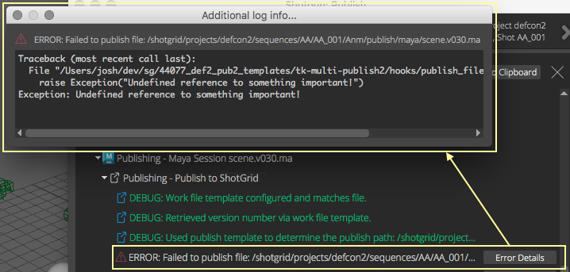

Shotgun Publisher API reference, |release|
##########################################

Overview
********

The Publish app is highly customizable by way of hooks that control how items
are presented to artists for publishing and how those items are then processed.
The following sections outline all of the hooks and APIs available to studios
for publish workflow customization.

----

Publish Execution
=================

The publisher has several phases of execution that developers should be aware
of before implementing custom publishing workflows.

Collection & Acceptance
-----------------------

When the Publisher is launched, items for the current user session are collected
via the collector hook. The :meth:`~.CollectorPlugin.process_current_session`
method of the configured collector plugin will be executed.

Similarly, if the user drags and drops external files, or browses external files
via the file browser, the collector plugin's
:meth:`~.CollectorPlugin.process_file` method will be executed.

These methods will create items to be displayed in the Publisher interface.
These items represent the "things" to be published.

Before the collected items are showing in the UI however, they will be processed
for acceptance. Each configured publish plugin will have a chance to accept each
collected item.

This acceptance phase has two tiers. The first tier is done by comparing the
collected item's type to a list of filters provided by the publish plugin. If
the item's type matches one of the plugin's filters, the second tier of
acceptance is executed by running the publish plugin's
:meth:`~.PublishPlugin.accept` method.

All collected items will display one or more publish plugins that accepted them
as tasks to be executed in the interface. These will show up as child items in
the UI. Each of these tasks represents an instance of the associated
publish plugin. Conceptually, these are the "actions" to be performed on the
items.

Item Review
-----------

Once the acceptance phase is complete, the user can review the items, make
changes to the target context of each, provide publish descriptions, take screen
grabs, and update settings. Additional files can be dragged and dropped or
browsed for collection.

Publishing
----------

After the artist had taken the time to review the collected items, they can
perform one of two actions.

#. They can run a validation pass on the items. This will execute the
   :meth:`~.PublishPlugin.validate` method on each publish plugin in the list
   in the order in which they are displayed, passing in their parent item as
   the item to process. Any errors or warnings logged during this phase will be
   displayed in the UI.
#. The user can also decide to run the full publish pass. This will include all
   the validation steps above followed by execution of each plugin's
   :meth:`~.PublishPlugin.publish` and :meth:`~.PublishPlugin.finalize` methods.
   The publisher will execute the ``publish`` method of each task, followed by
   the execution of each task's ``finalize`` method. Again, the order will match
   the order of tasks in the interface.

----

Collectors
**********

The collector hook handles processing the current user’s session for items to
publish. It also handles processing any file paths that have been dragged and
dropped onto the Publisher. It’s primary purpose is to discover and classify
items to present to the user for publishing.

To define custom collection behavior for drag/drop or within a DCC, you simply
need to write a collector plugin or take over and modify one of the collectors
that come with the shipped integrations. For example, to allow publishing of
cameras in Maya, you could take over the Maya collector and add the logic for
creating publish items for each camera to be published in the current session.

Collector API
=============

.. py:currentmodule:: tk_multi_publish2.base_hooks

.. autoclass:: CollectorPlugin
    :show-inheritance:
    :members:

----

Publish Plugins
***************

Publish plugins are hooks that handle processing of collected publish items.
After all items have been collected, the Publisher attempts to match the items
with the appropriate publish plugins. All matched plugins show up as child tasks
within the publish item hierarchy.

With ``tk-multi-publish2 v2.0.0`` and higher, each plugin can define a custom UI
that allows users to make changes to the publish settings prior to publishing.
See the methods and properties section below for details on how to implement a
custom publish plugin UI.

Like the collectors, you can override one of the shipped publish plugins or
write your own to meet the particular needs of your studio.

Publish Plugin API
==================

.. py:currentmodule:: tk_multi_publish2.base_hooks

.. autoclass:: PublishPlugin
    :show-inheritance:
    :members:

----

Publish Utilities
*****************

The publisher provides some utility methods that are generally useful for
writing publish plugins that aren't driven by templates. These methods are used
by the basic Shotgun integration to infer information from file paths when
templates are not available. This includes version and frame number
identification, publish display name, image sequence paths, etc.

.. note:: Most of these utility methods are exposed in the publisher but the
   implementation lives in the app's ``path_info`` hook. Studios can override
   these path processing methods to account for their own naming conventions and
   path structures.

The utilty method are documented below:

.. automodule:: tk_multi_publish2.util
    :members:
    :exclude-members: get_conflicting_publishes, clear_status_for_conflicting_publishes

----

Logging
*******

Any logging in the collector and publish plugin hooks will be displayed in the
progress details widget of the Publisher. The image below shows logging output
from a publish in Maya.

The standard logging methods can be used to display information, warnings,
errors, and debug messages to the user.

The publisher has a special logging handler that will make use of the standard
``extra`` :class:`dict` to display action buttons next to the log messages.
These special action button types are detailed below:

----

``action_button``
=================

A generic button to execute a callback method when clicked.

The :class:`dict` supplied takes the following form::

    "action_button": {
        "label": <label>,
        "tooltip": <tooltip>,
        "callback": <callback>,
        "args": <args>
    }

The values in the :class:`dict` are:

* ``label``: The text to display on the button itself
* ``tooltip``: The tooltip text to display when the mouse is over the button.
* ``callback``: The callable to execute when the button is clicked.
* ``args``: A dictionary to supply to the callback as keyword args.

Example:

.. code-block:: python

    self.logger.error(
        "Validation failed! Here's a quick fix that might work!",
        extra={
            "action_button": {
                "label": "Fix Geometry",
                "tooltip": "Click this button to auto-fix the bad geometry.",
                "callback": self._geometry_fix,
                "args": {
                    "local": True,
                    "verts": False
                }
            }
        }
    )

The image below shows how this action button would appear in the log output view
of the publish UI:

----

``action_show_folder``
======================

A common action for showing the folder for a supplied path in the system's file
browser.

The :class:`dict` supplied takes the following form::

    "action_button": {
        "label": <label>,
        "tooltip": <tooltip>,
        "path": <path>
    }

The values in the :class:`dict` are:

* ``label``: The text to display on the button itself. The default value is
  ``"Show Folder"``. Optional.
* ``tooltip``: Optional tooltip text to display when the mouse is over the
  button. The default value is ``"Reveal in the system's file browser."``.
* ``path``: Required path to the file.

Example:

.. code-block:: python

    self.logger.warning(
        "File is not named correctly. Open enclosing folder...",
        extra={
            "action_show_folder": {
                "path": file_path
            }
        }
    )

The image below shows how this action button would appear in the log output view
of the publish UI.

.. image:: ./resources/log_extra_action_show_folder.png

----

``action_show_in_shotgun``
==========================

A common action for showing an entity's detail page in Shotgun.

The :class:`dict` supplied takes the following form::

    "action_show_in_shotgun": {
        "label": <label>,
        "tooltip": <tooltip>,
        "entity": <entity>,
    }

The values in the :class:`dict` are:

* ``label``: The text to display on the button itself. The default value is
  ``"Show Entity"``. Optional.
* ``tooltip``: Optional tooltip text to display when the mouse is over the
  button. The default value is ``"Reveal the entity in Shotgun."``.
* ``entity``: Required, standard Shotgun entity :class:`dict`.

Example:

.. code-block:: python

    self.logger.info(
        "Publish created for file: %s" % (path,),
        extra={
            "action_show_in_shotgun": {
                "entity": {
                    "type": "PublishedFile,
                    "id": 1234
                }
            }
        }
    )

The image below shows how this action button would appear in the log output view
of the publish UI.

----

``action_show_more_info``
=========================

A common action for showing more information than what typically fits on a
single line of logging output. The output will be shown in a text browser popup
dialog.

The :class:`dict` supplied takes the following form::

    "action_show_more_info": {
        "label": <label>,
        "tooltip": <tooltip>,
        "text": <text>,
    }

The values in the :class:`dict` are:

* ``label``: The text to display on the button itself. The default value is
  ``"More Info..."``. Optional.
* ``tooltip``: Optional tooltip text to display when the mouse is over the
  button. The default value is ``"Show additional logging info."``.
* ``test``: Required, :class:`str` with additional information to display to
  the user. The text can contain html for formatting for display in the popup
  window (any html tags supported by Qt's rich text engine).

Example:

.. code-block:: python

    try:
        # something that might fail...
    except Exception as e:
        import traceback
        self.logger.error(
            "Failed to publish file: %s" % (path,),
            extra = {
                "action_show_more_info": {
                    "label": "Error Details",
                    "tooltip": "Show the full error stack trace",
                    "text": "<pre>%s</pre>" % (traceback.format_exc(),)
                }
            }
        )
        raise

The image below shows how this action button would appear in the log output view
of the publish UI.

----

``action_open_url``
===================

A common action for opening a supplied URL in the default browser.

The :class:`dict` supplied takes the following form::

    "action_show_more_info": {
        "label": <label>,
        "tooltip": <tooltip>,
        "url": <url>,
    }

The values in the :class:`dict` are:

* ``label``: The text to display on the button itself. The default value is
  ``"Open URL"``. Optional.
* ``tooltip``: Optional tooltip text to display when the mouse is over the
  button. The default value is ``"Opens a url in the appropriate browser."``.
* ``url``: The url to open.

Example:

.. code-block:: python

    self.logger.info(
        "Render submitted. Time for coffee...",
        extra={
            "action_open_url": {
                "label": "Find Coffee",
                "url": "https://www.google.com/search?q=best+coffee+near+me"
            }
        }
    )

The image below shows how this action button would appear in the log output view
of the publish UI.

.. image:: ./resources/log_extra_action_open_url.png

.. .. py:currentmodule:: tk_multi_publish2.processing

.. .. autoclass:: Item
        :members:

.. .. autoclass:: Setting
        :members:

.. .. autoclass:: Task
        :members:

.. toctree::
    :maxdepth: 2
